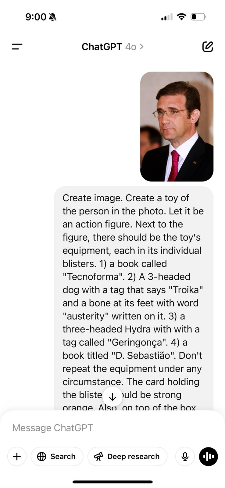
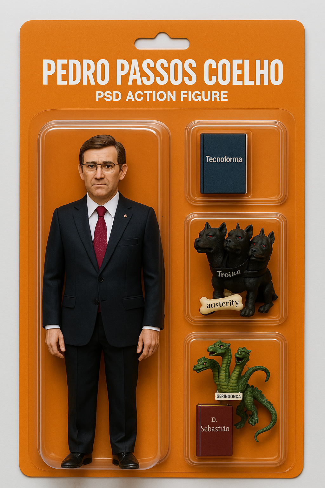

So.

On Sunday night I did a post on X that went viral[[1](https://x.com/patife/status/1906442934343634951)]. The post shows a bunch of politicians running for election in Portugal and the controversies they're known for. It had multiple reposts on Instagram and Facebook, Linkedin, and endless forwarding on Whatsapp. A friend even sent me a video of two old people laughing over the images on a shopping mall.

I've added instructions at the end of this text. 

Before you get to the How, a word if I may.

The point of my post is to make people laugh, and I did it because why not. And we all did laugh a bunch. 

Why did it succeed? What people tell me they liked the most is the little accessories that each character has. Those details make the persons impossibly real even though they look like toys. No matter how you see those politicians, innocent, guilty, a misunderstood genius or a dumb ass, you want to look at them all. All get roughly the same treatment, in about the same space. The memes evoque reality, or that side of reality that we know is there, that has to be considered among other things.

The internet has opened an era of overabundance of information. Most of what is written is bullshit, but that isn't new. Even before there were computers, crap was the filling material of most of the serious newspapers and books that serious-looking people published. Among all the cow dung, a couple of fresh ideas.

AI will only explode the amount of content available.

A way to cut through the noise is to condense information. It's only natural that readers need shorter material to be able to process so many news, so much art, so much entertainment. Texts (sms), GIFs, emojis, (video) shorts and memes are quite evolved ways of sharing thoughts and emotions that would take much longer to communicate in other forms. But this isn't new, or exclusive to the technology that irritates the ludites and intelectuals. The world has been on a journey of helping humans transmit information in a dense way for a long time, certainly much longer than the internet. Cave men would sum up their hunting achievements in a cave painting. On the same space we can now tell multiple stories with detail to spare. And a single emoji can tell someone to go f themselves. 

So, the problem isn't the size of the messages, or that they make people laugh. The problem of readers in 2025 is the same problem of readers in 1925 — how to find the good stuff to read. Every day I will read a bit of long books [[2](/marcel-proust-in-search-of-lost-time/)], and I will also try to find more good stuff online. I have to search hard and choose well.

The fact that modern short communication gets abused only tells me that its usefulness to the population at large. The speaker wants to communicate more, the listener doesn't want pointless crap. It's good that we are communicating efficiently.

Memes are good.

Full Instructions!

This was done on March 31st 2025. Models will become more advanced. 

1) Go on ChatGPT and choose model 4o.
2) Upload an image of the person. Make it a clear, well lit image that shows the face.
3) Copy this prompt, and adapt it to the person and what you want there.

> Create image. Create a toy of the person in the photo. Let it be an action figure. Next to the figure, there should be the toy's equipment, each in its individual blisters. 1) a book called "Tecnoforma". 2) A 3-headed dog with a tag that says "Troika" and a bone at its feet with word "austerity" written on it. 3) a three-headed Hydra with with a tag called "Geringonça". 4) a book titled "D. Sebastião". Don't repeat the equipment under any circumstance. The card holding the blister should be strong orange. Also, on top of the box, write 'Pedro Passos Coelho' and underneath it, ‘PSD action figure'. The figure and equipment must all be inside blisters. Visualize this in a realistic way.

4) Submit
5) Adjust. Sometimes the image will be cut. You have to ask ChatGPT to "draw the whole figure, including the full person". Other times the person will have legs cut, so just reply "you cut the legs, render the whole body". Another error is that the person isn't inside the plastic, so just reply "the person should be inside the blister". A few times the image just doesn't look good and I just replied "do it again, carefully." When I wasn't satisfied I started a new ChatGPT message and did it all over again. 

This is what it will look like in ChatGPT.

This is what a good result looks like.

  

